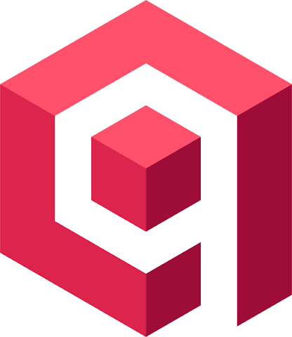
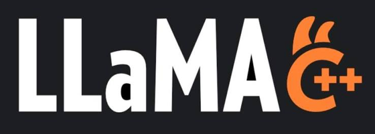
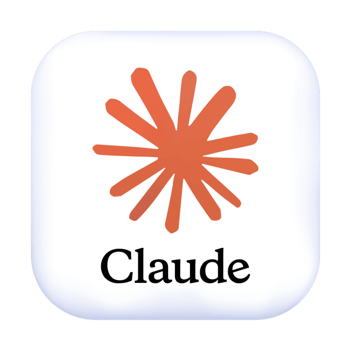

<h1 align="center">Hello there! I'm Gianlorenzo Mungiovino</h1>

<h3 align="center">🔹 Passionate about technology, IT and sound design. 🔹 I enjoy diving deep into challenges and finding solutions. 🔹 Full-Stack Web Developer.</h3>

- 🔭 I'm currently working on [GSD-Qdrant-Knowledge](https://github.com/gianlorenzomungiovino/GSD-Qdrant-Knowledge.git)
  

- 👨‍💻 Check it out [https://github.com/gianlorenzomungiovino](https://github.com/gianlorenzomungiovino)

- 💬 Proficient in **HTML, CSS, Javascript, React, Typescript, Node.js, VS Code**

- 📫 Email **gm@mungiovino.it**

- ⚡ Fun fact **I'm a musician and sound designer!**

<h3 align="left">Connect with me:</h3>

<h3 align="left">Languages and Tools:</h3>

                 

